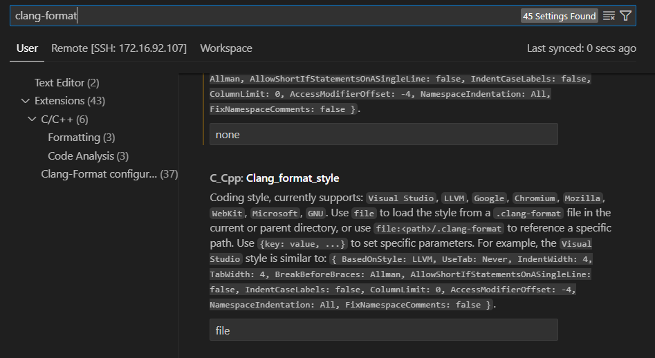
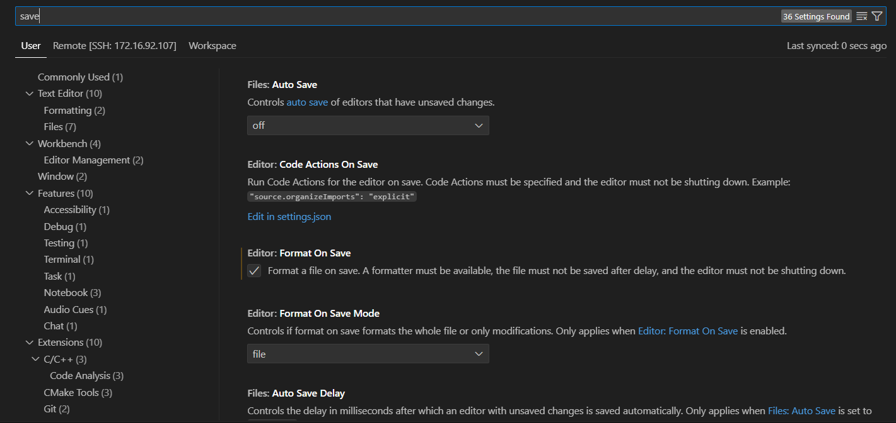

# C++ Coding Style

This README details the specific coding style guidelines adopted for C++ code within our project. We primarily follow the Google C++ Coding Style Guide with some minor adjustments to suit our team's specific needs.

# Prerequisites

- C++ compiler supporting clang-format (e.g., GCC, Clang)
- Install ```clang-format``` on your host  
    > sudo apt-get install clang-format
- [VS Code with the "C/C++" extension installed](https://code.visualstudio.com/docs/languages/cpp)
- [VS Code with the "Clang-Format" extension installed](https://github.com/xaverh/vscode-clang-format)
- Access to the project repository to copy the file or content of ```.clang-format```.

# Configuration and Usage

## .clang-format file

- A ```.clang-format``` file is located in the project root directory. This file references the Google C++ style configuration with slight modifications specific to our project.

- You can customize this file further if needed (refer to the Google C++ Style Guide for details).

## VS Code Integration:

- In VS Code settings, ensure ```"C_Cpp: Default Clang format file"``` points to the project's .clang-format file.

    

- Optionally, enable automatic formatting on save (```"editor.formatOnSave": true```).

    

## Formatting

- Code inconsistencies will be highlighted based on the defined style.

- Use the ```Format Document``` command (Shift+Alt+F) to manually apply formatting.

- Automatic formatting on save ensures consistent style throughout your code.

# Key Points

- We primarily adhere to the Google C++ Coding Style Guide principles for readability and maintainability.

- The project-specific .clang-format file allows minor adjustments tailored to our team's preferences.

- Consistent formatting reduces cognitive load and facilitates teamwork.

# Additional Resources

- Google C++ Coding Style Guide: https://google.github.io/styleguide/cppguide.html

- Clang-Format Style Options: https://clang.llvm.org/docs/ClangFormatStyleOptions.html

# Contributing

If you have suggestions for improving the C++ coding style or the configuration, feel free to contribute via pull requests or discussions. We welcome your input!

- **Why Modify the Configuration Parameters?**   
    ```Clarify the purpose behind adding or modifying configuration parameters. Understanding the need helps us make informed decisions about the changes.```

- **Provide Comparisons for Improvement**  
    ```When proposing changes, provide a comparison between the current and proposed configurations. Explain why the suggested modifications are beneficial and how they enhance the project.```

- **Collaborative Decision Making**  
    ```We believe in collective decision-making. Assemble the committee to discuss proposed changes and decide on their adoption based on merit and alignment with project goals.```

- **Scope of Updates**   
    ```Determine whether the updates should be comprehensive or partial based on the project's current status. This ensures that contributions are aligned with the project's roadmap and goals.```


